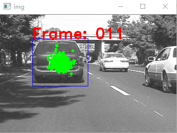

# Particle Filtering Description

In this project, you are required to implement a particle filtering algorithm to complete an object tracking task.

You should handle your codes and a brief introduction of your solutions.

## Prerequisites

You are going to learn how to process image/video data with `OpenCV` library in this project. Install OpenCV  before your coding work with `pip` command:

```bash
# Use pip to install
pip install opencv-python==3.4.2.16 # This version is recommanded.

# You can also use conda to install (conda should be installed previously)
conda install opencv=3.4.2.16
```

For detailed information about OpenCV, see the official documentation: https://docs.opencv.org/3.4.2/d6/d00/tutorial_py_root.html

## File Structure

### particle_filter_class.py

In this file, some basic components of particle filtering are defined.

- `Rect` class describes the rectangle bounding box (simplified as bbox) of an object.
  - **You do not need to edit the codes of this part!**
  - Key attributes:
    - `(lx, ly)`: The left-top coordinate of the bbox. `lx` is the column index and `ly` is the row index in pixel.
    - `(w, h)`: The width and height of the bbox in pixel.
- `Particle` class describes a single particle, which is actually corresponded to a `Rect` instance.
  - You are not strictly required to use this class. You can also use a numpy array to denote a particle.
  - If you use this class, you need to complete the method `transition()`.
  - Key attributes:
    - `(cx, cy)`: The center coordinate of the bbox. `cx` is the column index and `cy` is the row index in pixel.
    - `(sx, sy)`: The ratio of the bbox width/height on a reference width/height. E.g. `sx = w / ref_w`.
    - `weight`: Optional. The weight of the current particle.
    - `sigmas`: Optional. The standard deviation of the particle transition probability.
- **You need to complete some functions as follows:**
  - `extract_feature()`: The feature extraction function.
    - Extract feature of the bbox region on the image in order to compute similarity among different regions.
    - An intensity-based feature is adopted as default feature. For a bbox region, a feature vector is returned with shape $(1, W_{ref}, H_{ref})$.
    - It is highly recommended to choose better features by yourselves.
  - `transition_step()`: The state transition function.
    - Re-sample the position of current particle at next state via Gaussian distribution.
    - Parameter `sigmas` controls the standard deviation of the attributes of the particle.
    - If you complete the `transition()` method in the `Particle` class, you can just call this method in `transition_step()`.
  - `weighting_step()`: The weight computation function.
    - Compute the similarity between each particle and the tracking template feature to get weight for each particle.
    - **You need to complete a `compute_similarity()` function to show the process of similarity computation.**
    - The normalized weight (that is, `sum(weights) == 1`) for each particle should be returned.
  - `resample_step()`: The re-sampling function.
    - Re-sample the particles according to the weight of each particle. Particles with higher weight should be kept while those which are lower weighted should be reduced or eliminated.
    - **Remind: the total number of  the particles should remain unchanged!**

### particle_filter_tracker_main.py

In this file, the main function of the particle filtering is implemented. In this project, the relative path is adopted to load data, please mind the file structure.

#### Pipeline

There are 4 stages of the particle filtering tracking algorithm.

1. **Transition**. In this stage, `transition_step()` is called to apply transition of the particle states to predict the particle distribution in current frame.
2. **Weighting**. In this stage, `weighting_step()` is called to compute the similarity between each particle and the tracking template. Finally, the weight of each particle is determined.
3. **Decision**. In this stage, the weights and distribution of the particles are analyzed to determine the target position. Then the tracking template is generated for next frame. Here the simplest strategy is adopted: The particle with the highest weight is considered as the tracking result of current frame. Its feature vector acts as the template of the next frame.
4. **Re-sampling**. In this stage, `resample_step()` is called to re-sample according to the weights of the particles.

You need to complete `extract_feature()`, `transition_step()`, `weighting_step()` and `resample_step()`. In the weighting stage, you need to explicitly call a sub-function named `compute_similarity()` in order to make us clear about your similarity metric design.

#### Key Parameters

* `test_split`: The name of the evaluation dataset. You can choose *car* or *David2*. Mind that *David2* is harder than *car*.
* `ref_wh`: The reference size of the particle. In default feature extraction function, intensity-base feature is used to describe the bbox region. For consistency of the feature size, we resize the bbox region to a corresponding size with the reference size `ref_wh`.
* `sigmas`: The standard deviations of the particle transition.
* `feature_type`: The type of feature you use.
* `n_particles`: The total number of particles. Higher value results in better tracking performance but lower running speed.
* `step`: The interval between two images. `step=1` means consecutive image loading; `step=2` means that one frame will be skipped. The higher this value, the harder to track. You can test your tracking algorithm by selecting harder `n_particles` and `step` values.

## Tips

Follow the pipeline in the main function, you can implement a simple particle filtering algorithm. **However, this pipeline is just for reference. We encourage you to develop better implementations.**

Some tips about the code details:

- In the main function, a list of `Particle` instances is used to denote a group of particles. You can use numpy array (shape=$(N,4)$) as an alternate for faster batch operation.
- The first frame is processed out of the main loop. In the main loop, the image processing starts from the second frame.
- If the program runs correctly, you will see the tracking result of each frame in a independent pop-out window. The result images will be saved in `results` folder of this project.



#### Become Even Better!

* Try to explore better strategies in the decision stage. You may ...
  * Use particle distribution density (containing more particles) to smoothly filter target position. In the simplest strategy, target position is only determined by the highest-weighted particle.
  * Enable joint frame tracking. You can try to use features from multiple frames to compute the tracking template. This may avoid the bad influence on the following frames when the first frame is tracked incorrectly.
* Use the debug function `show_img_with_rect()` to visualize the bbox and the particle distribution in each frame for you convenient debugging.

