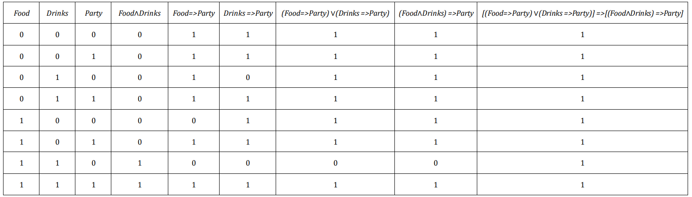

### 
 **Artificial Intelligence—Spring 2022** 
  ##  
#### 
 Homework 3 
 ####

Issued: March 21th, 2022 &ensp;&ensp;&ensp;&ensp;&ensp;&ensp;&ensp;&ensp;&ensp;&ensp;&ensp;&ensp;&ensp;&ensp;&ensp;&ensp;&ensp;&ensp;&ensp;&ensp;&ensp;&ensp;&ensp;&ensp;&ensp;&ensp;&ensp;&ensp;&ensp;&ensp;&ensp;&ensp;&ensp;&ensp;&ensp;&ensp;&ensp;&ensp;&ensp;&ensp;&ensp;&ensp;&ensp;&ensp;&ensp;&ensp;&ensp;&ensp; Due: Apr. 2nd, 2022
  
 

#### Problem 1 
Solutions:  
&ensp; &ensp; According to the title, there are 9 digits unknown in this problem and each digits represents a different number except the carry digits. The normal digits are in the range of 0 to 9 and the carry digits have value of 0 or 1. Moreover, the leading digit should not be 0. When using the MRV and least-constraining-value heuristics, we have following solving process:
1. Choose *C3* first, which can be either 0 or 1. Becasue *F* cannot be 0, we can determine *C3* as 1;
2. Choose *F*, which has only one option that *F* = 1;
3. According to MRV, we consider *C2* and *C1*. Assume *C2* equals to 0;
4. Then it is *C1*'s turn to choose a value. Assume *C1* = 0;
5. Now consider the constrains. Because *C3* = 0, *C2* = *C1* = 0, we can know that *O+O=R*, *W+W=U* and *T+T=O+10*. Furthermore, *R*、*U*、*O* are no bigger than 9, so *O* is less than 5 and it is even, which makes *O* the most constrained digit;
6. Assume *O* = 2(it cannot be 0 because *R* will be 0 if we use the forward checking), so *R* = 4 and *T* = 6;
7. Consider *U*, which has two options as 0 or 8 while W has tow options as 0 or 3. If *U* = 8(*U* should not be 0 for differnt digits represent different numbers), then *W* = 4, which disobeys the constrains. So trace back to step 6 and assume *O* = 4;
8. *R* and *T* both have one option, so R = 8 and *T* = 7;
9. Assume *U* = 6(it cannot be 2 or W will be 1), so *W* has only one option as 3, which can be a reasonable solution.  

&ensp; &ensp; All in all, one solution for this question is *T*=7, *W*=3, *O*=4, *F*=1, *U*=6, *R*=8.

  

#### Problem 2 
Solutions:
&ensp; &ensp; When using the AC-3 algorithm with the partial assignment {*WA* = *green*, *V* = *red*}, we can note the arcs *WA*—*NT*、*WA*—*SA*、*NT*—*SA*、*NT*—*Q*、*SA*—*Q*、*SA*—*NSW*、*SA*—*V*、*Q*—*NSW*、*NSW*—*V* as numbers from 1 to 9, and the process will be as follows:
1. pop arc 1, delete *green* in *NT*, enqueue arc 3 and 4;
2. pop arc 2, delete *green* in *SA*, enqueue arc 3、5、6、7;
3. pop arc 3, and no revision needed;
4. pop arc 4, and no revision needed;
5. pop arc 5, and no revision needed;
6. pop arc 6, and no revision needed;
7. pop arc 7, delete *red* in *SA*, enqueue arc 2、3、5、6;
8. pop arc 8, and no revision needed;
9. pop arc 9, delete *red* in *NSW*, enqueue arc 6 and 8;
10. pop arc 3, delete *blue* in *NT*, enqueue arc 4;
11. pop arc 4, delete *red* in *Q*, enqueue arc 5、6、8;
12. pop arc 3, and no revision needed;
13. pop arc 5, delete *blue* in *Q*, enqueue arc 4、6、8;
14. pop arc 6, delete *blue* in *NSW*, enqueue arc 8、9;
15. pop arc 7, and no revision needed;
16. pop arc 2, and no revision needed;
17. pop arc 3, and no revision needed;
18. pop arc 5, and no revision needed;
19. pop arc 6, and no revision needed;
20. pop arc 6, and no revision needed;
21. pop arc 8, delete *green* in *Q*, and no domain remained for *Q*. Inconsistency found!

 

#### Problem 3
Solutions:  
**a.** This statement is correct. Because *False* has no model, which means it entails every sentence while *True* is true in all models, which shows it is entailed by every sentence.
**b.** This statement is uncorrect. Because in every model where *True* is true, *False* is always false.
**c.** This statement is correct. This is because *A∧B* is true iff *A* and *B* are both true. In this case, *A⇔B* is true as well.
**d.** This statement is uncorrect. For example, if *A* and *B* are both false, we can conclude that *A⇔B* is true but *A∨B* is false.
**e.** This statement is correct. Because *A⇔B* is true iff *A⇒B* and *B⇒A* are both true and *¬A∨B* means *A⇒B*, every model makes the left-hand side true will make the right-hand side true as well.
**f.** This statement is correct. This is because *(A∧B)⇒C* is equivalent to *¬A∨¬B∨C*, which is what *(A⇒C)∨(B⇒C)* means too. Hence, every model that makes the left-hand side true will ensure the correctness of right-hand side.
**g.** This statement is correct. Use the distributivity, we can know that left-hand side is equivalent to *(¬A∨C)∧(¬B∨C)*, which is definitely what right-hand side means.

 

#### Problem 4 
Solutions:  
**a.** As the table shown below, the sentence is true for all the models, so it is valid.

**b.** The left-hand side:
&ensp;&ensp; *(Food=>Party)∨(Drinks=>Party)*
&ensp;&ensp; *(¬Food∨Party)∨(¬Drinks∨Party)*
&ensp;&ensp; *¬Food∨Party∨¬Drinks∨Party*
&ensp;&ensp; *¬Food∨Party∨¬Drinks*
The right-hand side:
&ensp;&ensp; *(Food∧Drinks)=>Party*
&ensp;&ensp; *¬(Food∧Drinks)∨Party*
&ensp;&ensp; *¬Food∨¬Drinks∨Party*
It is obvious that the CNF of the both sides are the same, so the original sentence is equivalent to the form *$\alpha$=>$\alpha$*, which is valid for any $\alpha$
**c.** Negate the sentence, we have:
&ensp;&ensp; *¬{[(Food=>Party)∨(Drinks=>Party)]=>[(Food∧Drinks)=>Party]}*
&ensp;&ensp; *¬{¬[(Food=>Party)∨(Drinks=>Party)]∨[(Food∧Drinks)=>Party]}*
&ensp;&ensp; *[(Food=>Party)∨(Drinks=>Party)]∧¬[(Food∧Drinks)=>Party]*
&ensp;&ensp; *[(¬Food∨Party)∨(¬Drinks∨Party)]∧[(Food∧Drinks)∧¬Party]*
&ensp;&ensp; *(¬Food∨¬Drinks∨Party)∧Food∧Drinks∧¬Party*
It is obvious that there will be a empty clause after resolution, so the sentence is true.