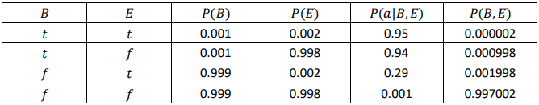
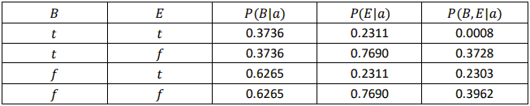
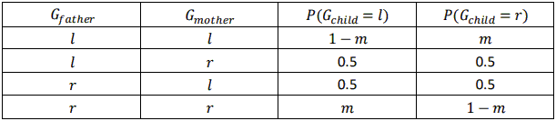
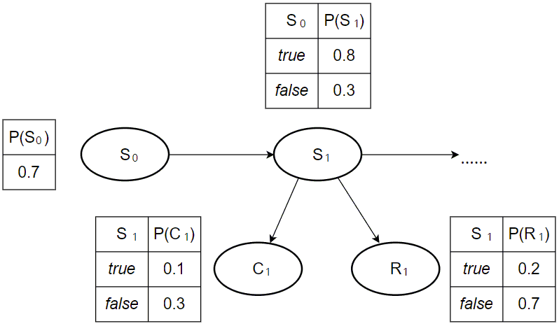
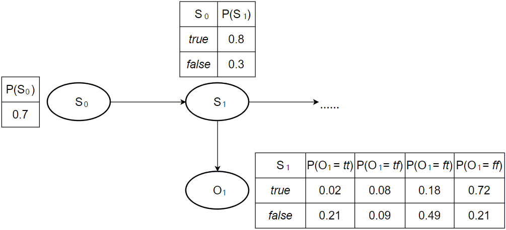

### 
 **Artificial Intelligence—Spring 2022** 
  ##  
#### 
 Homework 4 
 ####

Issued: Apr. 2nd, 2022 &ensp;&ensp;&ensp;&ensp;&ensp;&ensp;&ensp;&ensp;&ensp;&ensp;&ensp;&ensp;&ensp;&ensp;&ensp;&ensp;&ensp;&ensp;&ensp;&ensp;&ensp;&ensp;&ensp;&ensp;&ensp;&ensp;&ensp;&ensp;&ensp;&ensp;&ensp;&ensp;&ensp;&ensp;&ensp;&ensp;&ensp;&ensp;&ensp;&ensp;&ensp;&ensp;&ensp;&ensp;&ensp;&ensp;&ensp;&ensp; Due: Apr. 18th, 2022
  
 

#### Problem 1 
Solutions:  
**a.** Yes, *Burglary* and  *Earthquake* are independent if no evidence is observed. 
From numerical semantics: According to Figure 14.2 and the equation that *P(B,E)=$\Sigma_i$P(B)P(E)P($A_i$|B,E)*, we can conclude the following probabilities:

which shows that the joint distribution of *B* and *E*, *P(B,E)*, is the multiplication result of *B* and *E*'s marginal distributions, that is, *P(B,E)=P(B)P(E)*, so *B* and *E* are independent.
From topological semantics: Because *B* and *E* are d-separated by *A*, they are independent.
**b.** No, *Burglary* and  *Earthquake* are NOT independent if we observe *Alarm=true*. From the probability shown in the figure and the Bayesian theorem, we can compute the following probabilities: 

So it is obvious that *P(B|$a$)P(E|$a$)$\ne$P(B,E|$a$)*, which means *B* and *E* are not conditionally independent given *A*.

 

#### Problem 2 
Solutions:  
**a.** (c) is the figure that claims the equation. The equation needs *$G_{father}$*,*$G_{mother}$* and *$G_{child}$* to be independent from each other, which means no links should exist between the three genes.
**b.** (a) and (b) are consistent with the hypothesis, while (c) presents a contradictory independence of genes.
**c.** (a) is the best description of the hypothesis. Because the links between handedness are not mentioned in the theory.
**d.** According to the title, *$G_{child}$* node's CPT is as follows:

**e.** *$\because$ $P(G_{father}=l)=P(G_{mother}=l)=q$* 
&ensp;&ensp; *$\therefore P(G_{child}=l)=\Sigma_{g_f,g_m}P(G_{child}=l|g_f,g_m)P(g_f,g_m)$*
&ensp;&ensp;&ensp;&ensp;&ensp;&ensp;&ensp;&ensp;&ensp;&ensp;&ensp;&ensp;&ensp;&ensp;&ensp;&ensp;&ensp;&ensp; *$=\Sigma_{g_f,g_m}P(G_{child}=l|g_f,g_m)P(g_f)P(g_m)$*
&ensp;&ensp;&ensp;&ensp;&ensp;&ensp;&ensp;&ensp;&ensp;&ensp;&ensp;&ensp;&ensp;&ensp;&ensp;&ensp;&ensp;&ensp; *$=q^2(1-m)+0.5\times 2\times q\times (1-q)+(1-q)^2m$*
&ensp;&ensp;&ensp;&ensp;&ensp;&ensp;&ensp;&ensp;&ensp;&ensp;&ensp;&ensp;&ensp;&ensp;&ensp;&ensp;&ensp;&ensp; *$=q+m-2qm$*
**f.** According to genetic equilibrium, we have *$P(G_{child}=l)=q+m-2qm=q$*, so *$q=0.5$*. However, as what we have known about human handedness, the right-handedness is relevantly dominant, so the hypothesis described at the beginning must be wrong.

 

#### Problem 3 
Solutions:  
&ensp;&ensp; According to the professor's theory, we note random variables *$S_t$*、*$C_t$*、*$R_t$* to present whether a student get enough sleep on night *$t$*, whether a student sleep in class on the *$t$* th day, and whether a student have red eyes on the *$t$* th day. So the dynamic Bayesian network can be formulated as follows:

Combining the random variables *$C_t$*、*$R_t$* into one single random variable, *$O_t$*={*$C_t$*,*$R_t$*}, we can get the hidden Markov model with complete probability tabels as follows:

 

#### Problem 4 
Solutions:  
**a.** According to the DBN and HMM we have otained in Problem 3, we can compute the probabilities as follows:
&ensp;&ensp; *$P(S_0)=0.7$*
&ensp;&ensp; *$P(S_1)=\Sigma_{s_0}P(S_1|s_0)P(s_0)=0.7<0.8,0.2>+0.3<0.3,0.7>=<0.65,0.35>$*
&ensp;&ensp; *$P(S_1|e_1)=\alpha P(e_1|S_1)P(S_1)=\alpha <0.72,0.21><0.65,0.35>=<0.8643,0.1357>$*
&ensp;&ensp; *$P(S_2|e_1)=\Sigma_{s_1}P(S_2|s_1)P(s_1|e_1)=0.8643<0.8,0.2>+0.1357<0.3,0.7>=$*
*$<0.7322,0.2679>$*
&ensp;&ensp; *$P(S_2|e_{1:2})=\alpha P(e_2|S_2)P(S_2|e_1)=\alpha <0.18,0.49><0.7322,0.2679>=$*
*$<0.5010,0.4990>$*
&ensp;&ensp; *$P(S_3|e_{1:2})=\Sigma_{s_2}P(S_3|s_2)P(s_2|e_{1:2})=0.5010<0.8,0.2>+0.4990<0.3,0.7>=$*
*$<0.5505,0.4495>$*
&ensp;&ensp; *$P(S_3|e_{1:3})=\alpha P(e_3|S_3)P(S_3|e_{1:2})=\alpha <0.02,0.21><0.5505,0.4495>=$*
*$<0.1045,0.8955>$*
**b.** Similarly, we have:
&ensp;&ensp; *$P(e_3|S_3)=<0.02,0.21>$*
&ensp;&ensp; *$P(e_3|S_2)=\Sigma_{s_3}P(e_3|s_3)P(s_3|S_2)=<0.8\times 0.02+0.2\times 0.21,0.3\times 0.02+0.7\times 0.21>=<0.058,0.153>$*
&ensp;&ensp; *$P(e_{2:3}|S_1)=\Sigma_{s_2}P(e_2|s_2)P(e_3|s_2)P(s_2|S_1)=<0.8\times 0.058\times 0.18+0.2\times 0.153\times 0.49,0.3\times 0.058\times 0.18+0.7\times 0.153\times 0.49>=<0.0233,0.0556> $*
&ensp;&ensp; *$P(S_1|e_{1:3})=\alpha P(e_{2:3}|S_1)P(S_1|e_1)=\alpha<0.0233,0.0556><0.8643,0.1357>= $*
*$<0.7275,0.2725>$*
&ensp;&ensp; *$P(S_2|e_{1:3})=\alpha P(e_3|S_2)P(S_2|e_{1:2})=\alpha <0.058,0.153><0.5010,0.4990>=$*
*$<0.2757,0.7243>$*
&ensp;&ensp; *$P(S_3|e_{1:3})=<0.1045,0.8955>$*
**C.** Obviously, the smoothed probabilities integrated future observation values to refine the results, so it provides more accurate estimations than filtered analysis.