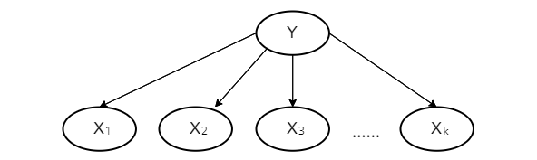

### 
 **Artificial Intelligence—Spring 2022** 
  ##  
#### 
 Homework 5 
 ####

Issued: Apr. 18th, 2022 &ensp;&ensp;&ensp;&ensp;&ensp;&ensp;&ensp;&ensp;&ensp;&ensp;&ensp;&ensp;&ensp;&ensp;&ensp;&ensp;&ensp;&ensp;&ensp;&ensp;&ensp;&ensp;&ensp;&ensp;&ensp;&ensp;&ensp;&ensp;&ensp;&ensp;&ensp;&ensp;&ensp;&ensp;&ensp;&ensp;&ensp;&ensp;&ensp;&ensp;&ensp;&ensp;&ensp;&ensp;&ensp; Due: Apr. 25th, 2022
  
 

#### Problem 1 
Solutions:  
*$ \because P(y|x)=\frac{1}{\sqrt{2\pi}\sigma}e^{-{\frac{(y-(\theta_1x+\theta_2))^2}{2\sigma^2}}}$*, and the data points are *$(x_j,y_j)$*
*$\therefore L=\Sigma_{j=1}^N\log\frac{1}{\sqrt{2\pi}\sigma}e^{-{\frac{(y_j-(\theta_1x_j+\theta_2))^2}{2\sigma^2}}}=-\Sigma_{j=1}^N\frac{(y_j-(\theta_1x_j+\theta_2))^2}{2\sigma^2}-N(\log\sqrt{2\pi}+\log\sigma)$*
Let the derivatives equal to 0, we have:
$$
\begin{align}
 & \frac{\partial L}{\partial \theta_1}=-\Sigma_{j=1}^N\frac{x_j(y_j-(\theta_1x_j+\theta_2))}{\sigma^2}=0 \\
 & \frac{\partial L}{\partial \theta_2}=-\Sigma_{j=1}^N\frac{y_j-(\theta_1x_j+\theta_2)}{\sigma^2}=0 \\
 & \frac{\partial L}{\partial \sigma}=\Sigma_{j=1}^N\frac{(y_j-(\theta_1x_j+\theta_2))^2}{\sigma^3}-\frac{N}{\sigma}=0
\end{align}
$$ Solve Equations (1)-(3), we can obtain that 
$$
\begin{align*}
 & \theta_1=\frac{N\Sigma_{j=1}^Nx_jy_j-(\Sigma_{j=1}^Ny_j)(\Sigma_{j=1}^Nx_j)}{N\Sigma_{j=1}^Nx_j^2-(\Sigma_{j=1}^Nx_j)^2} \\
 & \theta_2=\frac{1}{N}\Sigma_{j=1}^N(y_j-\theta_1x_j) \\
 & \sigma=\sqrt{\frac{\Sigma_{j=1}^N(y_j-(\theta_1x_j+\theta_2))^2}{N}}
\end{align*}
$$

#### Problem 2 
Solutions:  
**a.** $\because P(Y=true)=\pi$ 
&ensp;&ensp;$\therefore P(Y=false)=(1-\pi)$
&ensp;&ensp;$\because p$ of the $N$ samples are positive and $n$ of the $N$ are negative
&ensp;&ensp;$\therefore$ the probability of seeing this particular sequence of examples is $ l=\pi^p(1-\pi)^n$
&ensp;&ensp;and the log likelihood is $L=p\log\pi+n\log(1-\pi)$
**b.** Let the deriative equal to 0, that is
$$
\begin{align*}
\frac{\partial L}{\partial \pi}=\frac{p}{\pi}+\frac{n}{\pi-1}=0
\end{align*}
$$ &ensp;&ensp;and we obtain
$$ \pi=\frac{p}{n+p}=\frac{p}{N} $$ **c.** Acoording to the sumption, we have the Bayes network as follows:

**d.** Acoording to the additional notation,
$$
\begin{align*}
P(X_i=true|Y=true)=\alpha_i \\
P(X_i=true|Y=false)=\beta_i
\end{align*}
$$ &ensp;&ensp;Therefore, the likelihood for the data including the attributes is:
$$l=\pi^p[\Pi_{i=1}^k\alpha_i^{p_i^+}(1-\alpha)^{n_i^+}]\times(1-\pi)^n[\Pi_{i=1}^k\beta_i^{p_i^-}(1-\beta_i)^{n_i^-}]$$ &ensp;&ensp; that is,
$$l=\pi^p(1-\pi)^n\Pi_{i=1}^k\alpha_i^{p_i^+}\beta_i^{p_i^-}(1-\alpha_i)^{n_i^+}(1-\beta_i)^{n_i^-}$$ &ensp;&ensp; and the log likelihood is 
$$L=p\log\pi+n\log(1-\pi)+\Sigma_{i=1}^k[p_i^+\log\alpha_i+p_i^-\log\beta_i+n_i^+\log(1-\alpha_i)+n_i^-\log(1-\beta_i)]$$
**e.** Let the derivative equal to 0, we have:
$$
\begin{align*}
& \frac{\partial L}{\partial \alpha_i}=\frac{p_i^+}{\alpha_i}+\frac{n_i^+}{\alpha_i-1}=0 \\
& \frac{\partial L}{\partial \beta_i}=\frac{p_i^-}{\beta_i}+\frac{n_i^-}{\beta_i-1}=0
\end{align*}
$$ &ensp;&ensp; and the solution for these two equaltions are:
$$
\begin{align*}
& \alpha_i=\frac{p_i^+}{n_i^++p_i^+} \\
& \beta_i=\frac{p_i^-}{n_i^-+p_i^-}
\end{align*}
$$ &ensp;&ensp; In words, the value of $\alpha_i$ reprsents the proportion that $X_i=true$ given $Y=true$ and the value of $\beta_i$ reprsents the proportion that $X_i=true$ given $Y=false$.