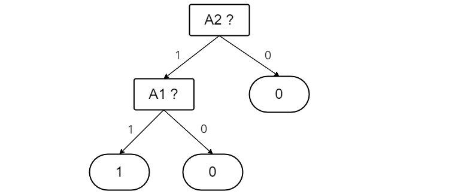

### 
 **Artificial Intelligence—Spring 2022** 
  ##  
#### 
 Homework 6 
 ####

Issued: May. 9th, 2022 &ensp;&ensp;&ensp;&ensp;&ensp;&ensp;&ensp;&ensp;&ensp;&ensp;&ensp;&ensp;&ensp;&ensp;&ensp;&ensp;&ensp;&ensp;&ensp;&ensp;&ensp;&ensp;&ensp;&ensp;&ensp;&ensp;&ensp;&ensp;&ensp;&ensp;&ensp;&ensp;&ensp;&ensp;&ensp;&ensp;&ensp;&ensp;&ensp;&ensp;&ensp;&ensp;&ensp;&ensp; Due: May. 16th, 2022
  
 

#### Problem 1 
Solutions:  
$\because$ When it comes to the information gain from the attribute test on $A_i$, we have
$$
\begin{align*}
Gain(A_i)=B(\frac{p}{p+n})-Remainder(A_i)
\end{align*}
$$ &ensp; &ensp; where $p$ and $n$ are the number of positive examples and negative examples respectively, and:
$$
\begin{align*}
Remainder(A_i)=\Sigma_{k=1}^d\frac{p_k+n_k}{p+n}B(\frac{p_k}{p_k+n_k})
\end{align*}
$$ &ensp; &ensp; where $p_k$ and $n_k$ are the number of positive and negative examples in subset $E_k$, obtained by dividing set according to $A_i$'s value.
$\therefore$ According to the title, we can obtain that:
$$
\begin{align*}
Remainder(A_1)=\frac{4}{5}B(\frac{2}{4})+\frac{1}{5}B(\frac{0}{1})=0.8000 \\
Remainder(A_2)=\frac{3}{5}B(\frac{2}{3})+\frac{2}{5}B(\frac{0}{2})=0.5510 \\
Remainder(A_3)=\frac{2}{5}B(\frac{1}{2})+\frac{3}{5}B(\frac{1}{3})=0.9510 
\end{align*}
$$ &ensp; &ensp; So the information gains are:
$$
\begin{align*}
Gain(A_1)=B(\frac{2}{5})-Remainder(A_1)=0.9710-0.8000=0.1710 \\
Gain(A_2)=B(\frac{2}{5})-Remainder(A_2)=0.9710-0.5510=0.4200 \\
Gain(A_3)=B(\frac{2}{5})-Remainder(A_3)=0.9710-0.9510=0.0200
\end{align*}
$$  &ensp; &ensp; In this case, $A_2$ is a better attribute to spilt on and should be chosen as the root.
&ensp; &ensp; Note that when $A_2$ is $0$, the outputs are $0$, too. So we can only consider the cases when $A_2=1$, that is, $\bm x_3$ to $\bm x_5$.
&ensp; &ensp; The remainders are:
$$
\begin{align*}
 & Remainder(A_1)=\frac{2}{3}B(\frac{2}{2})+\frac{1}{3}B(\frac{0}{1})=0 \\
 & Remainder(A_3)=\frac{1}{3}B(\frac{1}{1})+\frac{2}{3}B(\frac{1}{2})=0.6667
\end{align*}
$$ &ensp; &ensp; So the information gains are:
$$
\begin{align*}
 & Gain(A_1)=B(\frac{2}{3})-Remainder(A_1)=0.9183-0=0.9183 \\
 & Gain(A_3)=B(\frac{2}{3})-Remainder(A_2)=0.9183-0.6667=0.2516
\end{align*}
$$ $\therefore A_1$ is a better attribute to split on, and the decision tree can be sketched as follows:

&nbsp;

#### Problem 2 
Solutions:  
**a.** According to the title, the inputs are $\bm x$ and the hidden layer has a weight matrix $\bm w$, and we have a linear activation function $g(v)=cv+d$
&ensp; &ensp; $\therefore$ Suppose that $w_{i,j}$ is element at the $i^{th}$ row and the $j^{th}$ col of the matrix $\bm w$, we then have:
&ensp; &ensp; The value of the $j^{th}$ hidden layer unit before activation is:
$$
\begin{align*}
 & v_{1j}=\Sigma_i w_{i,j}x_i
\end{align*}
$$ &ensp; &ensp; and its output is:
$$
\begin{align*}
 & y_{1j}=g(v_{1,j})=c\Sigma_iw_{i,j}x_i+d
\end{align*}
$$ &ensp; &ensp; At the output layer, we have:
$$
\begin{align*}
 & v_k=\Sigma_j w_{j,k}y_{1j}=\Sigma_jw_{j,k}\big(c\Sigma_iw_{i,j}x_i+d \big)
\end{align*}
$$ &ensp; &ensp; So the final output is:
$$
\begin{align*}
 & y_k=g(v_k)=c^2\Sigma_ix_i\Sigma_jw_{i,j}w_{j,k}+d\big(c\Sigma_jw_{j,k}+1\big)
\end{align*}
$$ &ensp; &ensp; Obviously, a no-hidden-layer network with a weight of $w_{i,k}=\Sigma_jw_{i,j}w_{j,k}$ and an activate function of $g(v)=c^2v+d\big(c\Sigma_jw_{j,k}+1\big)$ can compute the same function.

**b.** When it comes to a network with an arbitrary number of hidden layers, we can reduce the network's layers like what we have done in part (a):
&ensp; &ensp; Assume we have a 2-layer network, so 
$$
\begin{align*}
 & y_{2k}=g(v_{2k})=c^2\Sigma_ix_i\Sigma_jw_{i,j}w_{j,k}+d\big(c\Sigma_jw_{j,k}+1\big)
\end{align*}
$$ &ensp; &ensp; Then at the output layer, 
$$
\begin{align*}
 & v_m=\Sigma_kw_{k,m}y_{2k}
\end{align*} 
$$ &ensp; &ensp; and 
$$
\begin{align*}
 & y_m=g(v_m)=c\Sigma_kw_{k,m}y_{2k}+d \\
 & \ \ \ \ =c^3\Sigma_ix_i\Sigma_j\Sigma_kw_{i,j}w_{j,k}w_{k,m}+d\big(c^2\Sigma_j\Sigma_kw_{j,k}w_{k,m}+c\Sigma_kw_{k.m}+1\big)
\end{align*}
$$
&ensp; &ensp; In this case, a no-hidden-layer network with a weight of $w_{i,m}=\Sigma_j\Sigma_kw_{i,j}w_{j,k}w_{k,m}$ and an activate function of $g(v)=c^3v+d\big(c^2\Sigma_j\Sigma_kw_{j,k}w_{k,m}+c\Sigma_kw_{k.m}+1\big)$ will perform the same as this 2-layer net. 
&ensp; &ensp; Similarly, we may generalize this theory to n-layer network, that is, a no-hidden-layer network with a weight of $w_{i,o}=\Sigma_{h_1}\Sigma_{h_2}\dots\Sigma_{h_n}w_{i,h_1}w_{h_1,h_2}\dots w_{h_n,o}$ and an activate function of $g(v)=c^{(n+1)}v+d\big[\Sigma_{m=0}^nc^{(n-m)}\Sigma_{h_1}\dots\Sigma_{h_{n-m}}w_{h_1,h_2}\dots w_{h_{n-m,o}}\big]$ can compute the same function as it, and the output is:
$$
\begin{align*}
 & y_o=g\big(\Sigma_{i,o}w_{i,o}x_i\big)
\end{align*}
$$ &ensp; &ensp; which is still a linear function of the inputs.

**c.** For the one-layer network, the total number of weights is:
$$
\begin{align*}
 & m_1=n*h+h*n=2nh
\end{align*}
$$ &ensp; &ensp; If we transform this one-layer net to a no-hidden-layer network, we will obtain that:
$$
\begin{align*}
 & m_0=n*n=n^2
\end{align*}
$$ &ensp; &ensp; In particular the case $h \ll n$, it is apparent that $m_1 \ll m_0$, so the original network has far less weights and will compute faster. Additionally, we will understand the mapping relationship between the inputs and the outputs more easily. As a result, the original network has its advantages as well.
